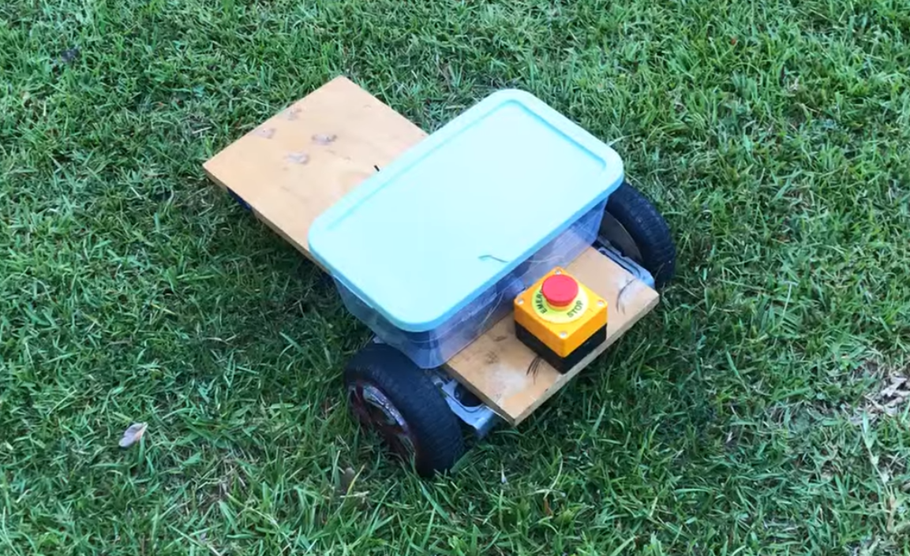

# Hoverboard RC Bot Project

This project converts a hoverboard motor into a remote-controlled bot using a zs-x11h v2 controller and a Raspberry Pi Pico W. The bot is controlled via a FlySky FS-iA6B receiver.  There is no end to this project.  This is just me getting a platform to start with for tinkering.




## Documentation
[- Schematic PDF: `/docs/hoverboardrcbotschematic.pdf`](docs/hoverboardrcbotschematic.pdf)


## Features

- Smooth motor control
- Safety cut-off
- PWM control from FlySky FS-iA6B

## Parts

- Old Hoverboard Wheels/Motors - Facebook Marketplace
- [Raspberry Pi Pico W](https://www.amazon.com/Pico-Raspberry-Pre-Soldered-Dual-core-Processor/dp/B0BK9W4H2Q)
- A board for a platform
- [A Harbor Freight 3.5in Caster Wheel](https://www.harborfreight.com/3-12-in-rubber-swivel-caster-61650.html?utm_medium=email&utm_source=Flex_Engage&utm_campaign=Store_Order_Confirmation&transaction_id=102f3a4e0e8bd4a11dd457e9eafae8)
- [Safety cut-off Switch](https://www.amazon.com/gp/product/B0C39XTMQW)
- [PWM control from FlySky FS-iA6B using iBus](https://www.amazon.com/gp/product/B0744DPPL8)
- [2PCS DC 6-60V 400W BLDC Three-Phase DC Brushless Motor Controller PWM Hall Motor Control Driver Board](https://www.amazon.com/gp/product/B0B3WVQLSP)
- [2 18v Ryobi Batteries in Series to make 36v](https://www.homedepot.com/p/RYOBI-ONE-18V-Lithium-Ion-Starter-Kit-with-2-0-Ah-Battery-4-0-Ah-Battery-and-Charger-PSK106SB/327848851)
- [2 Ryobi Battery Breakouts](https://www.amazon.com/gp/product/B0C5QQHKG7)
- [XT60 Power Connectors](https://www.amazon.com/gp/product/B07Q2SJSZ1)
- [Wego Wire Nuts](https://www.amazon.com/Compact-Splicing-Connector-Assortment-221-2401/dp/B0CJ5QF3VX)
  


## Setup

1. **Clone the Repository:**
   ```bash
   git clone https://github.com/yourusername/hoverboard-rc-bot.git
   cd hoverboard-rc-bot
2. **Wiring:**
   Connect the Raspberry Pi Pico W, zs-x11h v2 controller, and FlySky FS-iA6B receiver as per the schematic in `/docs/hoverboardrcbotschematic.pdf`.

3. **Upload the Code:**
   Upload the provided code to your Raspberry Pi Pico W.

## Usage

1. **Power On:**
   Ensure all connections are secure and power on the system.

2. **Control:**
   Use the FlySky FS-iA6B remote control to operate the bot.


## License

MIT License
