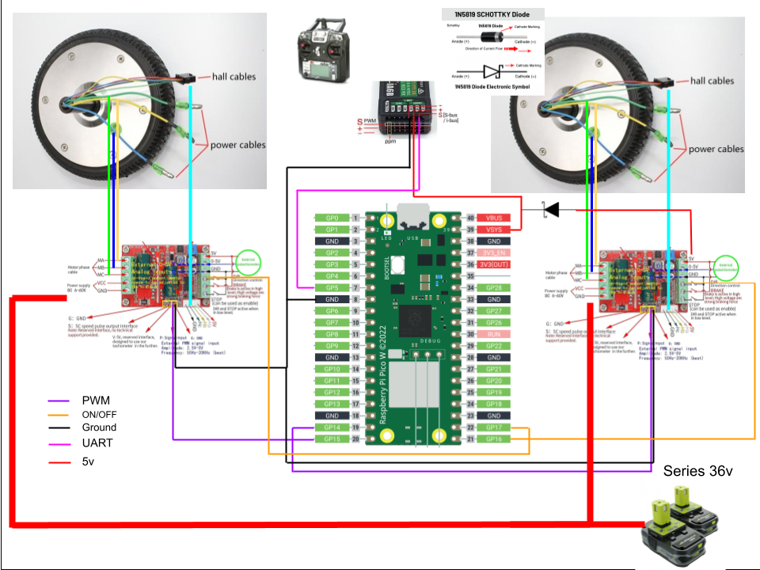

# Hoverboard RC Bot Project

This project converts a hoverboard motor into a remote-controlled bot using a zs-x11h v2 controller and a Raspberry Pi Pico W. The bot is controlled via a FlySky FS-iA6B receiver.



## Features

- Smooth motor control
- Safety cut-off
- PWM control from FlySky FS-iA6B

## Setup

1. **Clone the Repository:**
   ```bash
   git clone https://github.com/yourusername/hoverboard-rc-bot.git
   cd hoverboard-rc-bot
2. **Wiring:**
   Connect the Raspberry Pi Pico W, zs-x11h v2 controller, and FlySky FS-iA6B receiver as per the schematic in `/docs/hoverboardrcbotschematic.pdf`.

3. **Upload the Code:**
   Upload the provided code to your Raspberry Pi Pico W.

## Usage

1. **Power On:**
   Ensure all connections are secure and power on the system.

2. **Control:**
   Use the FlySky FS-iA6B remote control to operate the bot.

## Documentation

- Schematic: `/docs/hoverboardrcbotschematic.pdf`

## License

MIT License
